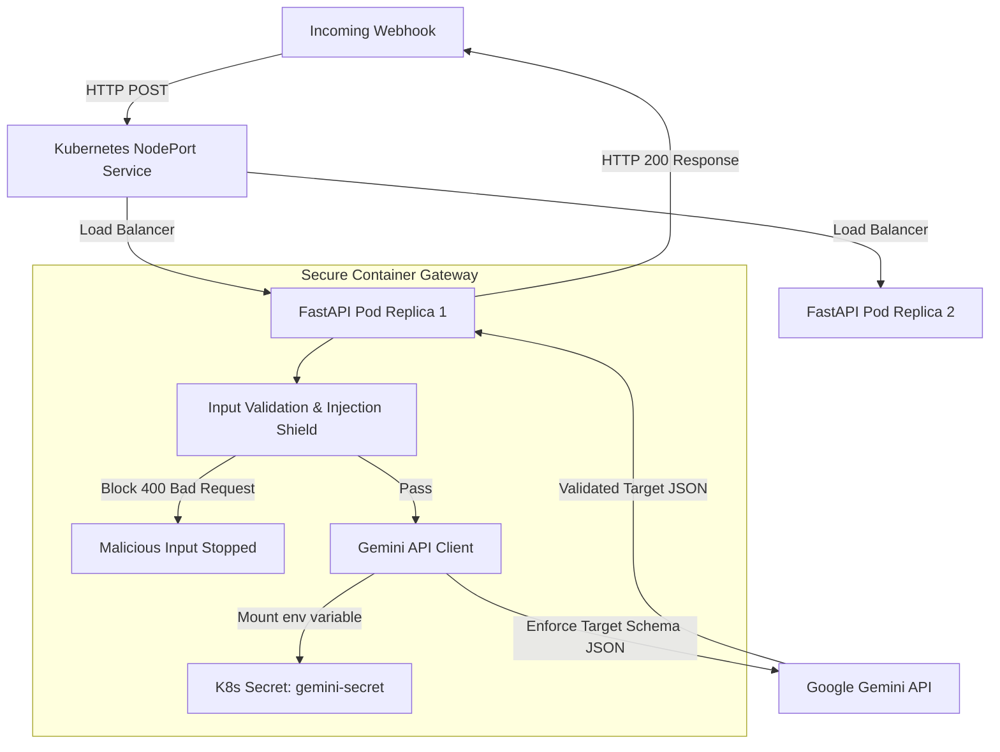

# 🔌 Secure LLM Gateway: Dynamic Webhook Schema Translator

An end-to-end, production-grade LLM middleware gateway designed to solve the "API integration spaghetti" problem. This microservice dynamically maps, translates, and formats arbitrary incoming JSON webhooks to match any target JSON schema using Google Gemini.

It is built with **FastAPI**, containerized with **Docker** (non-root security context), and orchestrated inside **Kubernetes** using high-availability replicas, health probes, and secure secrets management.

---

## 🏗️ Architecture Flow



---

## 🛡️ Core Features & Engineering Practices

### 1. Dynamic API Translation (AI Integration)
*   Uses **Gemini 3.6-flash** to perform real-time, zero-shot schema mapping.
*   Maps nested keys, renames properties, merges text fields, and translates data types (e.g. status strings to booleans) dynamically.
*   Enforces output structures using Gemini's grammar-based **Structured Outputs** (`response_schema`), ensuring the LLM never hallucinates invalid JSON properties.

### 2. MLSecOps & Input Defense
*   **Prompt Injection Filter:** Gateway checks incoming strings for common jailbreak phrases (e.g., *"ignore previous instructions"*) and rejects them with a `400 Bad Request` before calling the model.
*   **DoS Defense:** Strict length checks limit input strings to 2000 characters to prevent buffer-inflation memory attacks.
*   **Information Disclosure Defense:** Sanitizes application exceptions to prevent internal Python stack traces from leaking to API clients.

### 3. Secure Containerization (Docker)
*   **Multi-stage Builds:** Isolates the build dependencies inside a temporary `builder` image and copies only compiled packages to the final lightweight `runner` stage.
*   **Non-Root Privilege Separation:** Configures a dedicated system user (`appuser` with home directory) to execute the server process, mitigating container escape vulnerabilities.

### 4. Resilient Kubernetes Orchestration
*   **High Availability:** Deploys a ReplicaSet of **2 identical pods** to guarantee continuous uptime.
*   **Self-Healing Health Checks:** Implements `/healthz` HTTP probes for **Liveness** (reboots deadlocked containers) and **Readiness** (withholds traffic during container startup).
*   **Resource Bounds:** Limits pod memory to `256Mi` and CPU to `500m` to prevent cluster resource starvation.
*   **Secrets Isolation:** Uses Kubernetes Secrets to mount the API Key into memory at pod creation, ensuring no secrets are committed to Git.

---

## 🚀 Setup & Execution

### 1. Local Development
Make sure you are in the `mlops/` directory, set up your virtual environment, and install dependencies:
```bash
python3 -m venv venv
source venv/bin/activate
pip install -r requirements.txt
```

Create a local `.env` file:
```env
GEMINI_API_KEY=your_gemini_api_key_here
```

Start the local development server:
```bash
python -m uvicorn app:app --reload --port 8000
```

---

### 2. Deploying to Kubernetes (Minikube)
Start your local cluster:
```bash
minikube start
```

Load the local Docker image into the Minikube registry:
```bash
docker build -t webhook-translator:v1 .
minikube image load webhook-translator:v1
```

Provision the API key securely inside the cluster:
```bash
kubectl create secret generic gemini-secret --from-literal=api-key="your_gemini_api_key_here"
```

Apply the deployment manifest:
```bash
kubectl apply -f deployment.yaml
```

Start the port proxy tunnel to access your NodePort service:
```bash
minikube service webhook-translator-service --url
```

---

## 🧪 Testing the API
Send a POST request containing a source payload and your target schema using `curl`:
```bash
curl -X POST http://127.0.0.1:PORT/translate \
-H "Content-Type: application/json" \
-d '{
  "source_payload": {
    "id": "ord_998811",
    "customer": {
      "first_name": "Rittvik",
      "last_name": "Vashishtha",
      "email_address": "rittvik@example.com"
    },
    "payment_status": "authorized",
    "created_at": "2026-08-30T10:45:00Z"
  },
  "target_schema": {
    "type": "object",
    "properties": {
      "order_id": {"type": "string"},
      "buyer_name": {"type": "string"},
      "buyer_email": {"type": "string"},
      "is_paid": {"type": "boolean"},
      "date_formatted": {"type": "string"}
    },
    "required": ["order_id", "buyer_name", "buyer_email", "is_paid", "date_formatted"]
  }
}'
```
